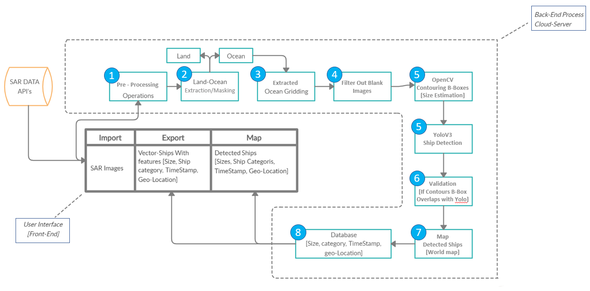
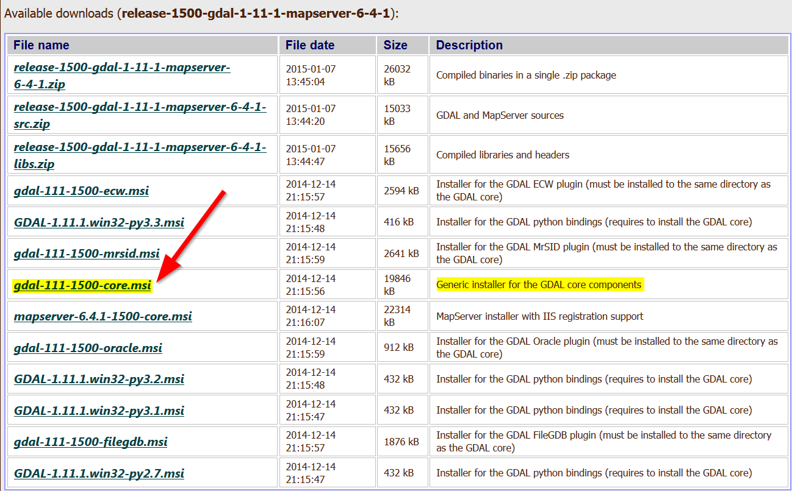
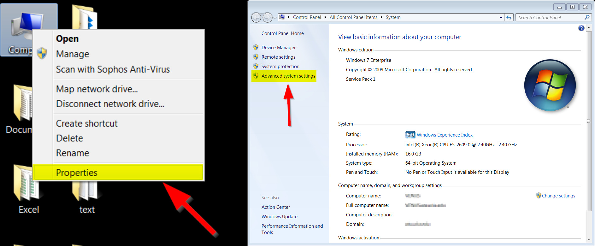
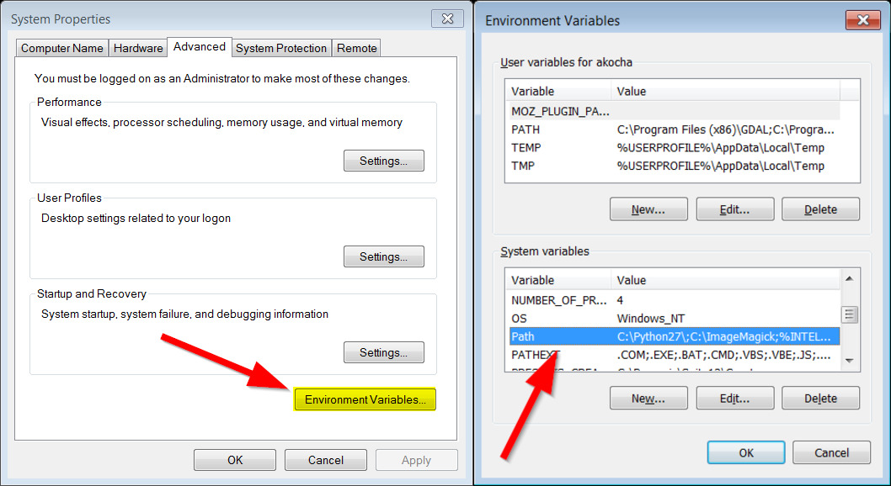
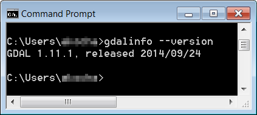
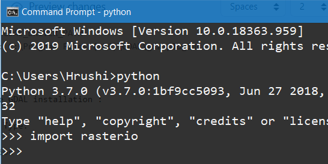

# NM404_AzmuthStar
# Size Invariant Ship detection from SAR images.

## Brief Summary

*If you would like to contribute a translation in another language, please feel free! You can add it as a pull request and we will merge it when we get the chance.*

This repository is a tutorial for how to use AzmuthStar Apllication on Windows 10, 8, or 7. (It will also work on Linux-based Os with some minor changes.) It was originally written using Python 3.7x, but will also work for newer versions Python.

we also made a YouTube video that walks through a demo tutorial.

[](https://www.youtube.com/watch?v=5nwadU7w8Z8)

This readme describes every step required to run the application : 
1. Installation of Gdal
2. Installation of rasterio
3. Installation of Requirements for Python
4. Download Weight File and setup the file path
5. Download Shapefile File and setup the file path
6. Testing 

The repository provides all the files needed to run the AzmuthStar Gui Application on your machine and the sample testing image provided in the SAMPLE folder.

## Introduction
Aim : Size Invariant Ship Detection From SAR Images.

Organisation: Indian Space Research Organisation [ISRO]

Team : AzmuthStar    

PSID : NM404

Team_ID: 4141

Team Leader : Krishna Ganpat Kadam

Mentor : Prof. Y. H. Bhosale

Description : SAR satellites provide useful information for object detection. A methodology needs to be developed to detect ships at ocean area using SAR data and estimate size of the detected ships (size invariant). The methodology should be applicable for different resolution SAR data of same bands.
## Software Architecture

<p align="center">
  
</p>

## Steps
### 1. Installation of Gdal
Gdal (Geospatial Data Abstraction Library) is a useful command tool to process spatial data.

I. Check Python version and MSC version :
1) Download the latest 2.7x version of python or any version you want.
2) install python with the default options and directories.
3) After installation, go to Python IDLE to find out what version of Python you are using and make a note of the number that shows the version of your python in the top right as highlighted below:

<p align="center">
  
</p>

I. Install GDAL :
1) Head over to [Tamas Szekere's Windows binaries](http://www.gisinternals.com/release.php) and download the appropriate GDAL binary.
    For this tutorial we are using MSC v.1900 on 64 bit.the picture below illustrates how to match the version with your own python version. 

<p align="center">
  
</p>

2) Clicking the link it will take you to the list of binaries (installers) to download.Then Locate the “core” installer, which has most of the components for GDAL.

<p align="center">
  
</p>

3) Next, Install the python bindings for your version of Python, this can either be 2.7, 3.1, or 3.x. 

<p align="center">
  
</p>

4) After downloading the Python bindings, install them.

II. Adding Path Variable :
1) Right click on “Computer” on the desktop and go to “Properties”:
2) Click on Advanced System Properties

<p align="center">
  
</p>

3) Select Environment Variables.
4) Under the System variables pane, find the ‘Path’ variable, then click on Edit.

<p align="center">
  
</p>

5) Go to the end of the box and copy and paste the following:
```
C:\Program Files (x86)\GDAL
```
6) In the same System variables pane, click on “New” and then add the following in the dialogue box:
```
Variable name : GDAL_DATA
Variable value : C:\Program Files (x86)\GDAL\gdal-data
```
7) Click Ok!
8) Add one more new variable by clicking “New…”
9) Add the following in the dialogue box:
```
Variable name : GDAL_DRIVER_PATH
Variable value : C:\Program Files (x86)\GDAL\gdalplugins
```
10) Click “OK”

III. Testing the GDAL installation : 

1) Open CMD and Type:
```
gdalinfo --version
```
2) Press Enter.

<p align="center">
  
</p>

### 2. Installation of rasterio
1) Download the rasterio package wheel from [Here](https://www.lfd.uci.edu/~gohlke/pythonlibs/) then,
```
pip install rasterio-1.1.5-xxx-xxx-win_amd64.whl
```
<p align="center">
  
</p>

### 3. Installation of Requirements for Python
Clone this repository then go to repo location and hit below command : 
```
pip install -r requirements.txt
```
### 4. Download Weight File and setup the file path

1) Yolo_Weights [You can also use your own yolo .weights file & .cfg by replacing them]
2) **Download The Yolo Weight [HERE](https://drive.google.com/drive/folders/1Vj0SL16r9-9W_dD_hoBXfMHBIaE3lYxM).**
3) **Move .weight and .cfg file in Object_detection/* Folder.**

### 5. Download Shapefile File and setup the file path
1) Shapefile [You can also use your own shapefile for Land Water descrimination: Just go to the Preprocessing.py and paste your shapefile path to **LineNo 37.**]
2) **Download the ShapeFile [Here](https://drive.google.com/drive/folders/1MKLMnlXF_3P_drw-DljkeEPCL6ekGfmC)**
3) **Move Shapefile Directory to processes/**


